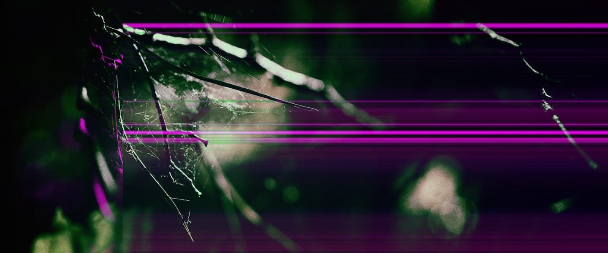

# haven.

a safe space?

A software synth for the norns platform. Two unique oscillators: one high, one low, One self-oscillating feedback loop with built-in ladder filter, smearing the pitch of the oscillators. Finally, audio in.

Control? No. But a lot of influence.

Seriously? Yes, but:

+ KEY_1 — (thy olde) toggle
+ KEY_2 — next control set
+ KEY_3 — hold for extra-fine influence
+ ENC_1 — (thy olde) main volume
+ ENC_2 — influence frequency (or feedback)
+ ENC_3 — influence amplitude

-----

Sound engine by [LFSaw.de](http://lfsaw.de) ([Till Bovermann](http://tai-studio.org)), GUI and awesome general help by [artfwo](https://github.com/artfwo).